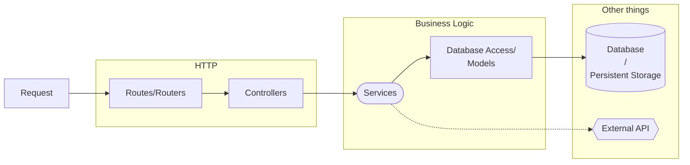
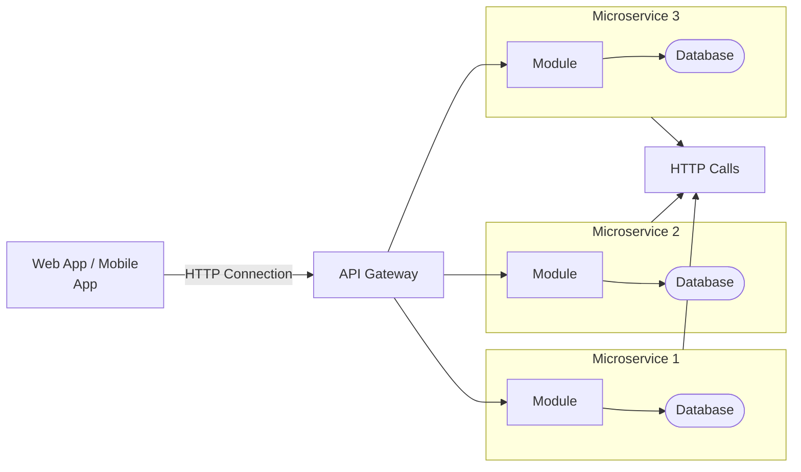

# Estructura

```mermaid
flowchart LR
    Request --> ruta[Routes/Routers]
    
    subgraph http[HTTP]
        ruta --> controladores[Controllers]
    end

    subgraph logica_negocio[Business Logic]
        controladores --> services([Services])
        services --> dba[Database Access/ \n Models]
    end

    subgraph Other things
        dba --> BD[(Database \n / \n Persistent Storage)]
        services -.-> eapi{{External API}}
    end

```

```mermaid
flowchart LR
    web_movil[Web App / Mobile \n App] --HTTP Connection--> api_gate[API Gateway]

    api_gate --> customer1
    api_gate --> customer2
    api_gate --> customer3

    subgraph micro1[Microservice 1]
        customer1[Module] --> db1([Database])
    end

    subgraph micro2[Microservice 2]
        customer2[Module] --> db2([Database])
    end

    subgraph micro3[Microservice 3]
        customer3[Module] --> db3([Database])
    end

    direction LR
    micro1 --> http_calls[HTTP Calls]
    micro2 --> http_calls
    micro3 --> http_calls
```