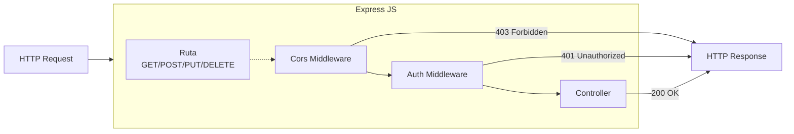

### Descripción

Guia 5: Se implementaron los middleware custom, un manejador de errores,
y un middleware para aplicar autenticación por Token.

```mermaid
flowchart LR
    http_req[HTTP Request] --> express
    subgraph express[Express JS]
        ruta[Ruta \n GET/POST/PUT/DELETE]-.->cors[Cors Middleware]
        cors-->auth[Auth Middleware]
        auth-->main[Controller]
    end
    cors--403 Forbidden-->http_res[HTTP Response]
    auth--401 Unauthorized-->http_res
    main--200 OK-->http_res
```