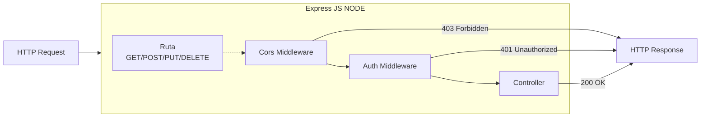
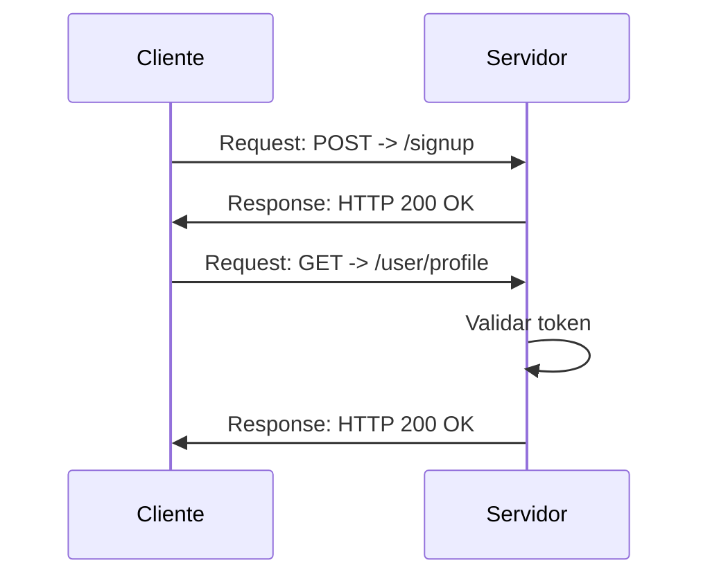

## Descripción

Guia 5: Se implementaron middlewares propios básicos, un manejador de errores, y un middleware para aplicar autenticación por Token.

> Nota: Aqui esta el ejemplo explicado en la guia, ademas del ejericio propuesto que esta asignado en la misma.

## Diagrama Middlewares

## Diagrama de autenticación basada en token

