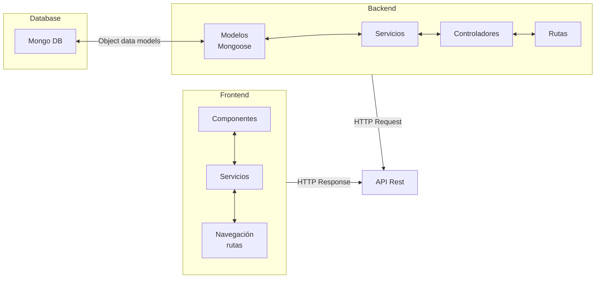
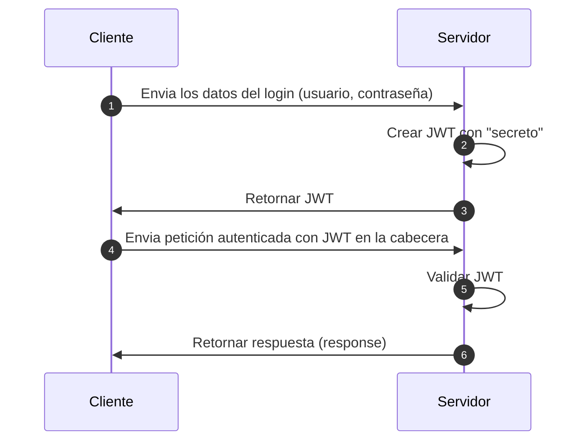
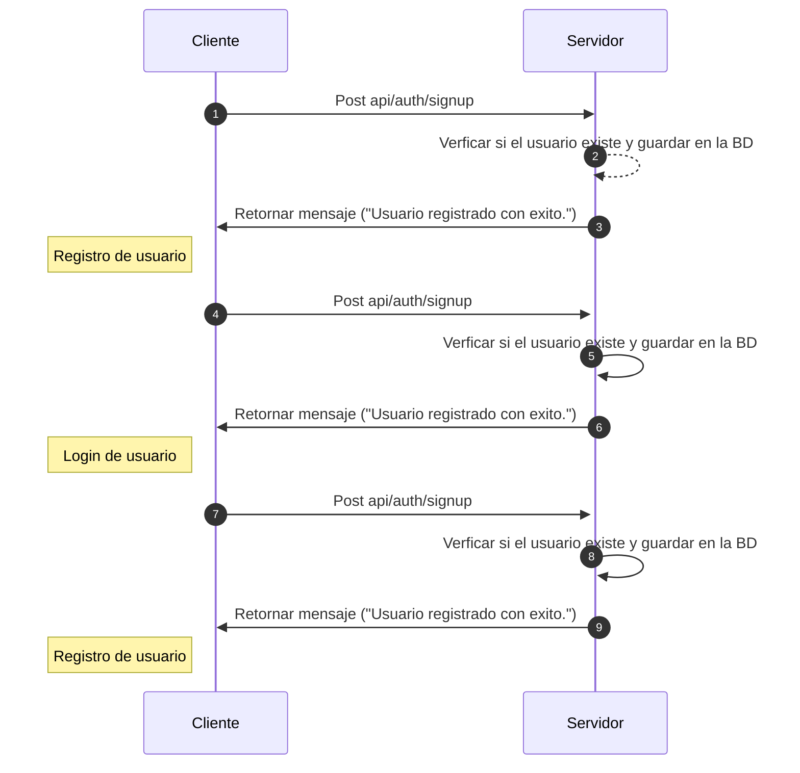

```mermaid
flowchart LR
    subgraph db[Database]
        mongo[Mongo DB]
    end
    subgraph back[Backend]
        direction BT
        mongo<--Object data models-->models[Modelos \n Mongoose]
        models<-->servicesB[Servicios]
        servicesB<-->controller[Controladores]
        controller<-->router[Rutas]
    end
    
    back--HTTP Request-->api[API Rest]
    front--HTTP Response-->api

    subgraph front[Frontend]
        components[Componentes]<-->servicesF[Servicios]
        servicesF<-->routerF[Navegación \n rutas]
    end
```

## Autenticación basada en Token

```mermaid
sequenceDiagram
    participant c as Cliente
    participant s as Servidor
    autonumber
    c->>s: Envia los datos del login (usuario, contraseña)
    s->>s: Crear JWT con "secreto"
    s->>c: Retornar JWT

    c->>s: Envia petición autenticada con JWT en la cabecera
    s->>s: Validar JWT
    s->>c: Retornar respuesta (response)
```

## Flujo para registrarse y logearse con autenticación JWT

```mermaid
sequenceDiagram
    participant c as Cliente
    participant s as Servidor
    autonumber
    c->>s: Post api/auth/signup
    s-->>+s: Verficar si el usuario existe y guardar en la BD
    s->>c: Retornar mensaje ("Usuario registrado con exito.")
    Note left of c: Registro de usuario

    c->>s: Post api/auth/signup
    s->>s: Verficar si el usuario existe y guardar en la BD
    s->>c: Retornar mensaje ("Usuario registrado con exito.")
    Note left of c: Login de usuario

    c->>s: Post api/auth/signup
    s->>s: Verficar si el usuario existe y guardar en la BD
    s->>c: Retornar mensaje ("Usuario registrado con exito.")
    Note left of c: Registro de usuario
```